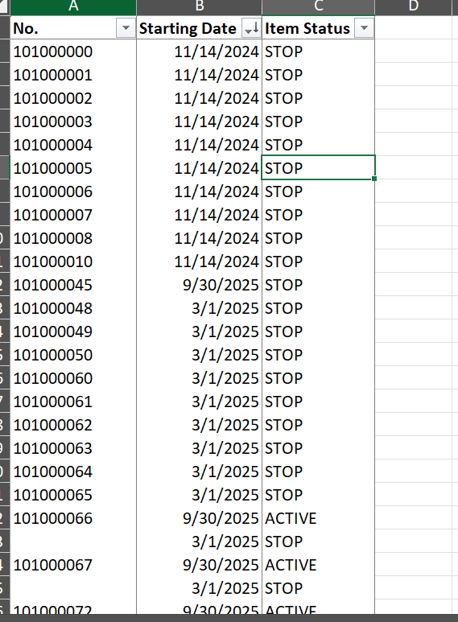
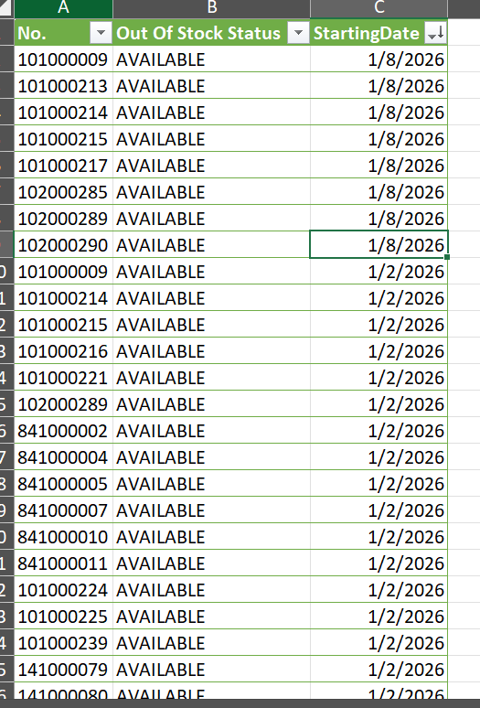
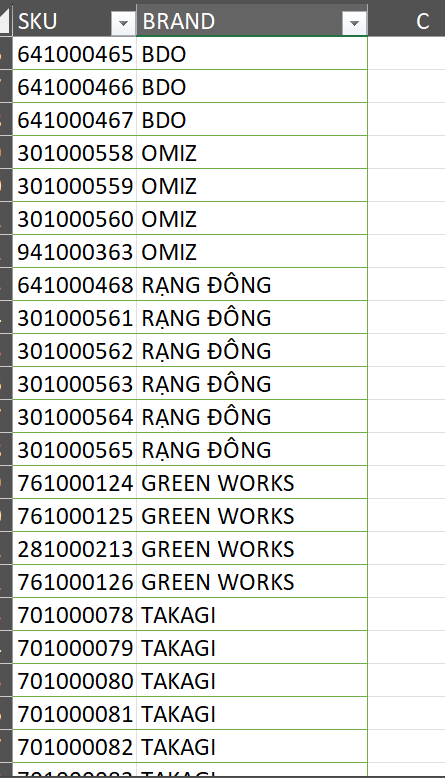

# 🗃️ Local Data Repository for Merchandise Insights  

---

## 📘 Giới thiệu
Sau khi xây dựng thành công **[Centralized Import Data Repository for Logistic Efficiency](https://github.com/tramdangtai/import-data-repository)** để lưu trữ dữ liệu hàng nhập khẩu, mình nhận ra rằng hệ thống dữ liệu nội bộ vẫn chưa đầy đủ — vì sao có Import Database mà không có Local Database?  

Mặc dù mỗi database phục vụ mục đích riêng, nhưng để đảm bảo **tính đồng bộ, thống nhất logic và cấu trúc dữ liệu trong phòng Merchandise**, mình quyết định phát triển thêm **Local Database** – nơi lưu trữ, quản lý, và chia sẻ toàn bộ dữ liệu liên quan đến hàng hóa nội địa (Local).  

Mục tiêu của dự án là **trao quyền chủ động cho các Local Buyer**, giúp họ tự tra cứu thông tin (như *Item Status, Vendor Status, Vendor Commission…*) mà không cần đợi mình cung cấp, đồng thời tạo ra **nguồn dữ liệu lịch sử** có thể phân tích xu hướng dài hạn.  

---

## 🎯 Mục tiêu dự án
- Xây dựng **Local Database** phục vụ riêng cho hàng hóa nội địa.  
- Đảm bảo **logic và cấu trúc dữ liệu thống nhất** với Import Database.  
- Giúp **Local Buyer chủ động lấy thông tin** mà không phụ thuộc người quản lý dữ liệu.  
- Lưu trữ **lịch sử thay đổi trạng thái SKU (như Out of Stock)** để theo dõi xu hướng biến động hàng hóa.  

---

## 🧩 Giải pháp thực hiện
- **Tái sử dụng và tích hợp dữ liệu** từ dự án [Local Replenishment System – Data-Driven Purchasing Optimization](https://github.com/tramdangtai/local-replenishment-system).  
- Duy trì **cấu trúc folder, file, field** tương tự các dự án trước để dễ quản lý và scale.  
- **Dùng Power Query** để tổng hợp dữ liệu, tạo mối liên kết và cập nhật dữ liệu định kỳ.  
- **Thông báo và hướng dẫn team** về cách sử dụng, kiểm tra dữ liệu và xác nhận tình trạng cập nhật.  

---

## 📊 Kết quả đạt được
- **Dữ liệu tập trung và đồng bộ** giữa các nhóm hàng (Import & Local).  
- **Local Buyer chủ động hơn** trong việc tra cứu và sử dụng dữ liệu.  
- **Cải thiện tốc độ phản hồi nội bộ** và giảm tải khối lượng công việc cho Data Owner.  
- **Hiển thị lịch sử thay đổi dữ liệu SKU**, giúp Buyer hiểu rõ xu hướng để đưa ra quyết định chính xác hơn.  

---

## 🛠️ Công cụ & Kỹ thuật sử dụng
- **Power Query** – tổng hợp và xử lý dữ liệu.  
- **Excel Data Model** – kết nối dữ liệu giữa các bảng.  
- **File Structuring & Version Control** – tổ chức folder và quản lý phiên bản dữ liệu.  
- **Team Communication & Documentation** – thông báo, hướng dẫn và chia sẻ kiến thức nội bộ. 

---

## 📸 Kết quả
### Hình ảnh - Item Status

  

### Hình ảnh - Item Out Of Stock

  

### Hình ảnh - Brand

  

---

## ✉️ Tác giả
**Tram Dang Tai**  
📍 Merchandise Assistant Database  
📧 [Liên hệ qua LinkedIn](https://www.linkedin.com/in/tramdangtai)
